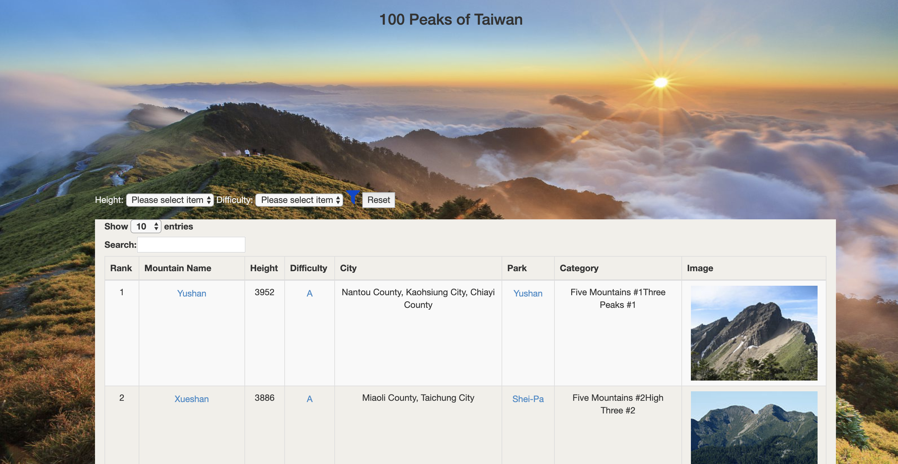

# 100PeaksOfTaiwan
# Yen-Ting Lin ylin2150@usc.edu
A full stack project starter code for NodeJS.
# Proposal
The purpose of 100 Peaks of Taiwan is let people know there are many beautiful seanery in my home country Taiwan. Since Taiwan is on the plate junction, it usually occur earthquake. This making Taiwan the world's fourth-highest island and there are several peaks over over 3,500 m. Many people came to Taiwan to challenge the 100 peaks in Taiwan, so I cearate the websit to let people known the basic knowledge about the peaks. 
# Overview Of Implementation
### Frontend 


# Feature
### Filter Table
* Allows user quickly filter out the specific height range or difficluty. 
### Table Sort 
* Click on table title can sort by numerical order or  alphabetical order
### Table data showing 
* User can choose number of data show in once
### Table Searching
* Allows user searching key words in the table 
### Mountain Information
* Click on mountain name or park will open new page search on google provide user more information
### Difficluty Information
* Click on each Difficluty will guide user about mountain difficluty

# Tools in use:
Frontend framework:HTML,CSS,Bootstrap4
Backend framework: Node.js express cheerio


# Web Page


# YouTube Link
[here](https://youtu.be/_F54roA_pxI)
# Install NodeJS

You can install NodeJs from [here](https://nodejs.org/en/download/).

# Running this package

To download and install:

```bash
git clone https://github.com/linyenting365/100PeaksOfTaiwan.git
cd nodejs_fullstack
npm install
```

## Running Backend:
```bash
cd backend
node main_app.js
```


## Running Frontend:
```bash
cd frontend
node app.js
```
Then open your browser to http://localhost:3000:
