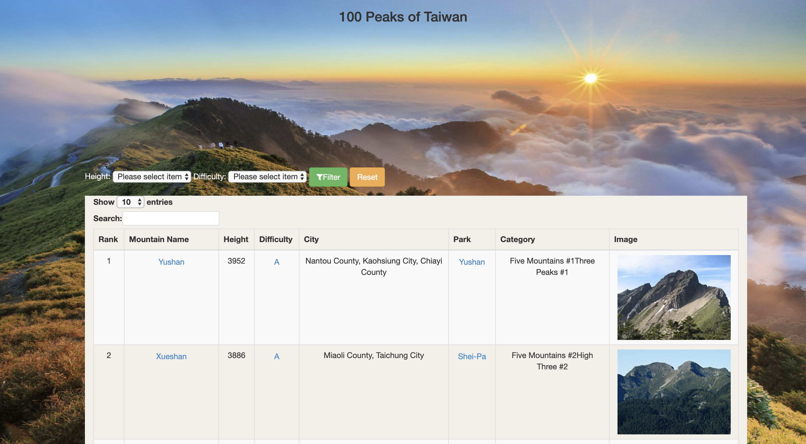

# 100Peaks Of Taiwan
## Yen-Ting Lin ylin2150@usc.edu
A full stack project starter code for NodeJS.
# Proposal
The purpose of 100 Peaks of Taiwan is let people know there are many beautiful seanery in my home country Taiwan. Since Taiwan is on the plate junction, it usually occur earthquake. This making Taiwan the world's fourth-highest island and there are several peaks over over 3,500 m. Many people came to Taiwan to challenge the 100 peaks in Taiwan, so I cearate the websit to let people known the basic knowledge about the peaks. 
# Overview Of Implementation


## Frontend 
* The Frontend is a webpage of 100 peaks of Taiwan data table 
  ### Filter function
  * User will have height and Difficluty option to choose. This function can filter out of the data using input button and sends an HTTP GET request to the backend. The backend responds with the request and provide the data which is filatere

## Backend
  * The backend will handle the request from the frontend and using the searching height and diffcluty function to find the data in the database. 
  * The backend database is generated by cheerio API to built the table of 100 peaks which include all the information
  
# Feature
### Filter Table
* Allows user quickly filter out the specific height range or difficluty. 
### Table Sort 
* Click on table title can sort by numerical order or  alphabetical order
### Table data showing 
* User can choose number of data show in once
### Table Searching
* Allows user searching key words in the table 
### Mountain Information
* Click on mountain name or park will open new page search on google provide user more information
### Difficluty Information
* Click on each Difficluty will guide user about mountain difficluty

# Tools in use:
Frontend framework:HTML,CSS,Bootstrap4
Backend framework: Node.js express cheerio

# Future Work
* add Google Map API to show the location of the mountain or city 
* add tour guide for each mountain 

## YouTube Link
[here](https://youtu.be/_F54roA_pxI)
# Install NodeJS

You can install NodeJs from [here](https://nodejs.org/en/download/).

# Running this package

To download and install:

```bash
git clone https://github.com/linyenting365/100PeaksOfTaiwan.git
cd 100PeaksOfTaiwan
npm install
```

## Running Backend:
```bash
cd backend
node app.js
```
You can test backend by installing and running [Postman](https://www.postman.com/downloads/):


## Running Frontend:
```bash
cd frontend
node app.js
```
Then open your browser to http://localhost:3000:

